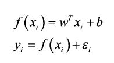
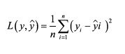
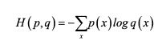
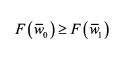
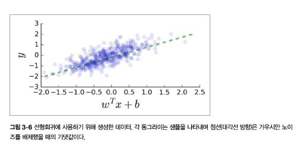
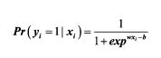
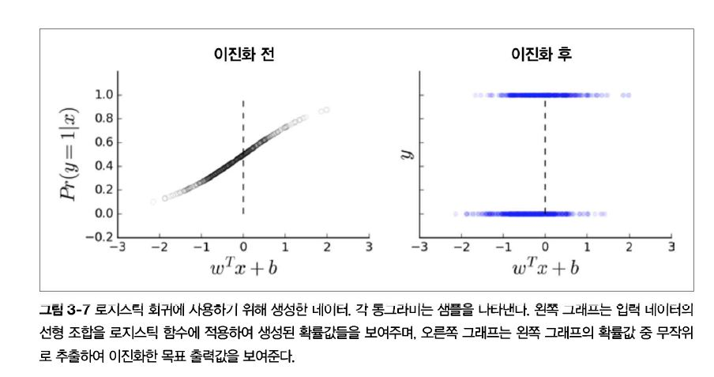

### 3장. 텐서플로 기본


#### 3.1 연산 그래프

##### 3.1.1 연산 그래프란?


- 그래프 : **노드**나 **꼭짓점**이라고 부르는 서로 연결된 **개체**의 집합

- 데이터 그래프에서 **변** : 어떤 노드에서 다른 노드로 흘러가는[^flow] 데이터의 방향 지정

- 텐서플로에서 노드 : 하나의 **연산**, 입력값을 받을 수 있고 다른 노드로 전달한 결과값을 출력할 수 있다.

  

  > 그래프를 계산한 다는 것 : 각각의 설비(노드)가 원자재(입력값)를 가져오거나 생성하여,
  >
  > ​	원자재를 가공한 후 다른 설비에 전달하는 과정을 순서대로 수행하여 부품을 만들고,
  >
  > ​		이러한 부분 생산 과정을 모아 최종 제품을 만들어 내는 것과 같다.


##### 3.1.2 연산 그래프의 장점

텐서플로는 그래프의 연결 상태를 기반으로 연산을 최적화한다. (?)  

각 그래프에는 노드 간에 의존관계가 존재한다.

**노드 y의 입력**이 **노드 x의 결과값**에 영향을 받을 때 *노드 y는 노드 x에 의존한다*고 말한다.

* 직접적으로 의존 : 두 노드가 하나의 변으로 직접 연결되어 있는 경우. *예)* B -> C

- 간접적으로 의존 : 두 노드가 하나의 변으로 직접 연결되어 있지 않은 경우. *예)* A -> C


-----------

#### 3.2 그래프, 세션, 페치

> 텐서플로의 동작은 그래프를 만들고 [^1] 실행하는[^2] 두 단계로 크게 나뉜다.  

##### 3.2.1 그래프 만들기

```python
# 1. 비어있는 기본 그래프가 만들어지며, 만드는 모든 노드는 이 기본 그래프에 자동 연결된다.
import tensorflow as tf

# 2. tf.<operator> 메소드를 사용해 임의로 명명된 변수에 할당된 6개 노드 생성
# 이 변수의 값은 연산의 출력으로 간주.

# - 세 노드는 상수값을 출력한다.
a = tf.constant(5)
b = tf.constant(2)
c = tf.constant(3)

# - 다음 세 노드는 계산 연산을 수행한다. 축약형 가능
d = tf.multiply(a, b)    # *
e = tf.add(c, b)         # +
f = tf.substract(d, e)   # -

```


​												[결과 그래프]


| 텐서플로 연산      | 축약형 연산자 | 설명                                                         |
| ------------------ | ------------- | ------------------------------------------------------------ |
| tf.add()           | a + b         | 대응되는 원소끼리 a와 b를 더한다.                            |
| tf.multiply()      | a * b         | 대응되는 원소끼리 a와 b를 곱한다.                            |
| tf.subtract()      | a - b         | 대응되는 원소끼리 a에서 b를 뺀다.                            |
| tf.divide()        | a / b         | 파이썬 3.x 방식으로 a를 b로 나눈다. (소수점까지)             |
| tf.pow()           | a ** b        | 대응되는 원소끼리 a의 b의 제곱을 계산한다.                   |
| tf.mod()           | a % b         | a를 b로 나눈 나머지                                          |
| tf.logical_and()   | a & b         | a와 b의 논리곱. dtype은 반드시 tf.bool                       |
| tf.greater()       | a > b         | 반대는 less() , 참 거짓 반환                                 |
| tf.greater_equal() | a >= b        | 반대는 less_equal() , 참 거짓 반환                           |
| tf.negative()      | -a            | a의 각 원소의 반대 부호의 값 반환                            |
| tf.logical_not()   | ~a            | a의 각 원소늬 반대의 참거짓 반환. dtype이 tf.bool인 객체에만 |
| tf.abs()           | abs(a)        | a의 각 원소의 절대값 반환                                    |
| tf.logical_or()    | a \| b        | a와 b의 논리합. dtype은 반드시 tf.bool                       |


##### 3.2.2 세션을 만들고 실행하기

연산 그래프를 만들고 나면 연산 그래프에 구성된 연산을 실행할 준비가 된 것이다.

연산을 실행하려면 세션을 만들고 실행한다. *위 코드에 추가*

```python
# 1. 그래프를 시작한다. 
sess = tf.Session()

# 2. 그래프 실행
outs = sess.run(f)    # f = tf.substract(d, e)

# 3. 세션을 닫는다.
sess.close()
print("outs = {}".format(outs))    # outs =  5
```


* Session 객체 : 텐서플로 API의 일부. 파이썬 객체와 데이터, 객체의 메모리가 할당되어 있는 실행 환경 사이를 연결하며, 중간 결과를 저장하고 최종 결과를 작업 환경으로 보내준다.
* sess.run() : 출력이 나와야 하는 노드에서 시작해 **역방향으로 처리**하여 의존관계 집합에 따라 실행되어야 하는 노드의 연산을 수행한다. 즉, 그래프에서 연산이 수행될 부분은 출력하고자 하는 내용에 따라 결정된다.
  * 인자로 넘겨준 노드에서 부터 해당 노드와 의존관계에 있는 노드를 역방향으로 거슬러가면서 연산.
* sess.close() : 세션을 닫는다. 세션세어 사용하는 자원을 해제한다.


##### 3.2.3 그래프의 생성과 관리

```python
# 기본 그래프가 만들어 진다.
import tensorflow as tf
print(tf.get_default_graph())  

# 새로운 그래프를 만들어서 g에 할당
g = tf.Graph()
print(p)     
```

* tf.Graph() : 텐서플로 객체로 표현되는 새로운 그래프를 만든다.
*  tf.get_default_graph() : 어떤 그래프가 현재 기본 그래프인지 반환.


````python
g = tf.Graph()
a = tf.constant(5)

print(a.graph is g)    # False
print(a.graph is tf.get_default_graph())   # True
````

연산이 g의 그래프가 아니라 기본 그래프(import)에 연결되어있다.

g를 기본 그래프로 지정하지 않았기 때문에 연산을 생성하면 새 그래프가 아니라 기본 그래프에 연결된다.


```python
g1 = tf.get_default_graph()
g2 = tf.Graph()

print(g1 is tf.get_default_graph())    # True

with g2.as_default():
    print(g1 is tf.get_default_graph())   # False
    
print(g1 is tf.get_default_graph())   # True
```

* with 구문을 as_default()와 함께 사용하면, 해당 그래프가 기본 그래프인 콘텍스트 관리자를 반환한다. 이 구문을 사용하면 명시적으로 세션을 닫지 않고 세션을 시작할 수 있다.


##### 3.2.4 페치

페치 : 연산하고자 하는 그래프의 요소, 텐서플로 메소드에 인수.

```python
with tf.Session() as sess:
    fetches = [a, b, c, d, e, f]
    outs = sess.run(fetches)
   
print("outs = {}".format(outs))
print(type(outs[0]))
```


----------------------

#### 3.3 텐서의 흐름

텐서플로에서 노드와 변이 실제로 표현되는 방법과 이들의 특성을 제어하는 방법을 설명한다.


##### 3.3.1 노드는 연산, 변은 텐서 객체

**예)** tf.add() 그래프에서 노드는 만들 때

1.  연산 인스턴스 생성
2. 계산된 결과를 다른 노드로 전달할 수 있는 핸들, 즉 **흐름(변, 텐서 객체)**으로 참조된다. (그래프 실행 전에는 실제 값을 내놓지 않는다.)


텐서플로는 모든 구성 요소가 담긴 그래프의 골격을 먼저 만들도록 설계되어있다. 이 시점에는 **실제 데이터는 흐르지 않으며 연산도 수행되지 않는다.** 세션이 실행되어 그래프에 데이터가 입력되고 계산될 때 연산이 수행된다.

텐서 객체는 각각 name, shape, dtype 같은 속성이 있어 식별 및 설정이 가능하다. 

**소스연산** : 이 전에 처리된 입력을 사용하지 않고 데이터를 생성하는 연산.


##### 3.3.2 데이터 타입 (dtype)

- 텐서 객체를 만들 때 데이터 타입을 지정하여 명시적으로 선택할 수 있다.

```python
c = tf.constant(4.0, dtype=tf.float64) #64비트 부동소수점
print(c)
print(c.type)
```

- 형변환

  - 일치하지 않는 두 데이터 타입을 가지고 연산을 실행 할 때 데이터 타입을 변견한다.

    ```python
    x = tf.constant([1,2,3], name='x', dtype=tf.float64)
    print(x.type)
    # 형변환
    # tf.cast(변환할 텐서, 새 데이터 타입)
    x = tf.cast(x, tf.int64)
    print(x.type)
    ```


##### 3.3.3 텐서 배열과 형태 (shape)

- 텐서라는 명칭의 2가지 사용

  - 그래프 연산의 결과에 대한 핸들
  - n차원 배열을 가리키는 수학 용어

  ```python
  import numpy as np
  
  # 2 X 3
  c = tf.constant([
      [1,2,3],
      [4,5,6]
  ])
  print("input1 : {}".format(c.get_shape()))
  
  # 2 X 2 X 3
  c = tf.constant(np.array([
      [[1,2,3],
      [4,5,6]] ,
      [[1,1,1],
      [2,2,2]]
  ]))
  print("input2 {}".format(c.get_shape()))
  ```

  - get_shape() : 텐서의 형태를 정수의 튜플로 반환. 튜플 원소 = 텐서의 차원 수 / 각 정수 = 차원의 배열 항목 개수

- **난수 생성기** : 텐서플로 변수의 초깃값을 지정하는 데 널리 사용. 

  

  ​	절단정규분포 : 평균으로부터 표준편차를 기준으로 크거나 작은 값들을 제거한 것.

  ​	균등분포 : 정해진 구간 [a,b] 사이에서 균등하게 값을 추출


- **행렬곱** 

```python

# 행렬 A와 벡터 x를 생성
A = tf.constant([
    [1,2,3],
    [4,5,6]
])
print(A.get_shape())    # (2, 3)

x = tf.constant([1,0,1])
print(x.get_shape())    # (3, )

# 행렬 A와 벡터 x를 곱하려면 x에 차원을 추가해서 
# 1차원벡터 -> 하나의 열을 가진 2차원 행렬로 만들어 줘야 한다.
x = tf.expand_dims(x, 1)   # x에 두번째 위치(인덱스 1)에 차원 추가
print(x.get_shape()) (3, 1)

b = tf.matmul(A, x)
```


##### 3.3.4 이름 (name)

- 각 텐서 객체마다 고유의 이름을 가진다.
- 변수와 다름. 텐서플로 내부에서 사용하는 String 형태의 이름


----------

#### 3.4 변수, 플레이스홀더, 간단한 최적화


##### 3.4.1 변수

- 최적화 과정은 주어진 모델의 매개변수를 조정하는 역할을 한다.
- 이를 위해 텐서플로는 변수를 사용한다.
- **세션이 실행될 때마다 '리필**'되는 다른 텐서 객체와 달리, **변수**는 그래프에 **고정된 상태를 유지**할 수 있다.
- 변수 사용 단계
  - **tf.Variable() 함수**로 변수 **생성**
  - **tf.global_variables_initializer() 메소드**로 세션에서 **초기화** 연산(변수에 메모리 할당 및 초기값 설정)
- 다른 텐서와 마찬가지로 변수도 모델이 실행될 때만 계산된다.


##### 3.4.2 플레이스 홀더

- **입력값을 공급**하기 위한 내장 구조 = **나중에 데이터로 채워질 빈 변수**

- 정의하면 **반드시 입력값을 밀어 넣어야 한다**. 

- 그래프를 구성하고 그래프가 실행되는 시점에 입력 데이터를 밀어 넣는데 사용한다.

  

  ```python
  ph = tf.placeholder(tf.float32, shape = (None, 10))
  ```

  shape 인수를 사용할 수 있다. **값이 지정되지 않거나 None으로 지정**되면 플레이스홀더는 **모든 크기의 데이터를 받을 수 있다**. 흔히 샘플 데이터의 개수(행)은 None을 사용하고, 특징의 길이(열)는 고정값을 사용한다.


```python
sess.run( s, feed_dict = { x : x_data, w : w_data} )
```

- 입력값은 **딕셔너리 형태로 Session.run() 메소드에 전달**되고, 딕셔너리의 **키**는 **플레이스홀더 변수의 이름**에 대응하며 **값**은 리스트나 넘파이 배열로 구성된 **데이터의 값**이다. 
- 예

```python
# 행렬 x
x_data = np.random.randn(5, 10)
# 벡터 w
w_data = np.random.dandn(10, 1)

with tf.Graph().as_default():
    # 행렬 x의 플레이스홀더
    x = tf.placeholder(tf.float, shape=(5, 10))
    # 벡터 w의 플레이스홀더
    w = tf.placeholder(tf.float32, shape=(10, 1))
    
    # -1로 채워진 상수 벡터 b
    b = tf.fill((5, 1), -1.)
    # 행렬곱, 5개의 원소를 가진 벡터 xw를 만든다.
    xw = tf.matmul(x, w)
    # 위 두개를 더한다.
    xwb = xw + b
    
    # tf.reduce_max() 연산을 사용해 벡터의 최댓값을 갖는다.
    s = tf.reduce_max(xwb)
    with tf.Session() as sess:
        outs = sess.run(s, feed_dict = {x: x_data, w: w_data})
    print("outs = {}".format(outs))
```


##### 3.4.3 최적화


**1.예측을 위한 학습**

몇 개의 목표변수 y를 가지고 있을 때, 이를 특징 벡터 x를 사용해 설명한다고 가정

이를 위해 이 둘을 연관 지을 수 있는 모델을 선택

학습 데이터의 값들은 원하는 관계를 잘 포착해내도록 모델을 조정하는 데 사용된다.


예로 해결할 회귀 모델 = 다변량 회귀모델



f(x)는 가중치 w와 절편 b를 입력 데이터인 c와 선형 조합한 결과라고 가정한다.

목표 y는 f(x)에 가우시안 노이즈 ε를 더한 값이다.

i는 주어진 하나의 샘플 데이터를 나타낸다.


1. 입력과 출력 데이터에 대한 적합한 플레이스홀더, 가중치와 절편에 사용할 변수를 만든다.

```python
# 입력 플레이스 홀더
x = tf.placeholder(tf.float32, shape=[None, 3])
# 출력 플레이스 홀더
y_true = tf.placeholder(tf.float32, shape = None)
# 가중치
w = tf.Variable([[0, 0, 0]], dtype=tf.float32, name='weights')
# 편향
b = tf.Variable(0, dtype=tf.float32, name='bias')

```

2. 다변량 회귀모델 : 예측 출력값 y_pred는 입력값 x와 가중치 w의 행렬곱에 편향을 더한 것

```python
y_pred = tf.matmul(w, tf.trenspose(x)) + b
```


**2. 손실 함수 정의하기**

모델의 성능을 평가할 수 있는 좋은 척도가 필요하다.

모델이 예측한 값과 관측값 사이의 불일치를 포착하려면 **거리**를 반영하는 척도가 필요하다.

이 거리를 흔히 **목적** 또는 **손실**함수라고 부르며, 이 함수의 **값을 최소화하는 매개변수(여기서는 가중치와 편향)**의 집합을 **찾아내는 것**이 바로 모델을 최적화 하는 것.

이상적인 손실 함수는 존재하지 않고, 모델에서 취하는 과정, 최소화늬 난도, 반드시 피해야하는 실수 등 여러 요소에 따라 선택한다.


**평균제곱오차 **

보통 흔히 사용하는 손실 함수는 평균제곱오차(MSE)이다. 

모든 샘플에서 실제 관측값과 모델 예측값 사이의 차를 제곱한 값의 평균이다.



관측된 값과 모델의 적합값 사이의 차이(**잔차**)의 제곱값의 평균을 최소화하는 것이 목적이다.


이 선형회귀모형에서는 **실제 관측값인 벡터 y_true(y)**와 **모델의 예측값인 y_pred(y')**의 차이를 가지고 

이 차이의 제곱을 계산하는 tf.square()를 사용한다. 이 연산은 원소끼리 수행된다.

그 다음 tf.reduce() 함수를 사용해 평균을 구한다.

```python
loss = tf.reduce_mean(tf.square(y_true - y_pred))
```


**교차 엔트로피**



정답 레이블이 하나인 분류 문제에서는 정답을 선택할 때 분류기가 부과하는 확률에 로그를 취한 값이 된다.

```python
loss = tf.nn.sigmoid_cross_entropy_with_logits(labels = y_true, logits = y_pred)
loss = tf.reduce_mean(loss)
```

교차 엔트로피는 두 분포 사이의 유사성을 재는 척도이다.

딥러닝에서 사용되는 분류 모델은 보통 각 클래스의 확률값을 계산하므로 실제 클래스 (분포 p)와 모델에서 제시한 클래스(분포 q)를 비교할 수 있다. 두 분포가 가까울수록 교차 엔트로피값은 더 작아진다.


**3. 경사하강법 최적화 함수**

손실 함수를 최소화하는 방법이다. 계산이나 분석을 통해 전역 최솟값을 찾아낼 수 있는 경우도 있지만, 대부분의 경우는 최적화 알고리즘을 사용해야 한다. **최적화 함수는 점점 손실 함수의 값이 줄어드는 방향으로 반복적으로 사중치 집합을 갱신**한다.

**경사 하강법**은 가장 흔히 사용되는 접근방법으로 가중치의 집합에 대한 손실의 경사(기울기)를 사용한다.

손실을 다변수 함수 F(w)라 할 때 어떤 점 w의 이웃 중 F(w)의 가장 가파른 내리막 경사 방향은 w에서 F의 음의 경사 방향으로 이동할 때 얻어진다.




**데이터 생성 방법**

경사값은 모델 매개변수에 대해서 계산되고 주어진 입력 샘플 x를 사용해 평가된다. 

이를 계산하기 위해 얼마나 많은 샘플이 필요한가. 가장 보편적인 방법은 확률적 경사 하강법(SGD)이다.

각 단계의 계산을 위해 알고리즘 전체 데이터를 투입하는 대신 **데이터의 부분 집합**을 **순차적으로 추출**한다.

한 번에 적용하는 데이터의 갯수는 한 단계레 하나에서 수백 개까지 다양하지만 **가장 일반적인 크기는 50 ~ 500개 사이**이며 때문에 이를 흔히 **미니배치**라고 부른다.

**배치 수**가 **작을 수록 빨리 학습**할 수 있고, **배치 크기**가 **작을 수록 계산을 빨라**진다. 그러나 **샘플 수가 적으면** 하드웨서 사용률이 낮아지고 분산이 커져 **비용 함수 결과가 크게 요동친다**는 단점이 있다.

 하지만 이 요동 덕분에 매개변수의 집합이 더 나은 지역 최솟값을 찾을 수 있는 새로운 곳으로 점프할 수 있으므로 꼭 나쁜것만은 아니라 상대적으로 작은 배치 사이즈가 효과적이고 선호된다.


**텐서플로의 경사 하강법**

텐서플로의 최적화 함수는 그래프에 새로운 연산을 추가하는 것만으로 경사값을 계산할 수 있고 알아서 미분을 하며 경사값을 계산한다.

**즉, 연산 그래프의 연산과 구조에서 경사 함수를 자동으로 유도하여, 알아서 경사값을 계산한다는 의미이다.**


**!** 매개변수 중 학습률을 설정하는 것이 중요한데, 이 값은 각 갱신 반복이 얼마나 적극적으로 이루어지는가. 즉, 음의 경사 방향으로 얼마나 크게 이동할 것인가를 결정한다.

손실 함수의 값이 쓸 만한 정도로 빠르게 감소해야 하지만 동시에 목표한 지점을 넘어서서 오히려 손실함수의 결과가 더 커질 만큼 크게 이동하는 것은 바람직하지 않다.

```python
# 학습률을 인수로 정하고
learning_rate = 0.01

# GradientDescentOptimizer() 함수를 사용해 최적화 함수를 생성한다.
optimizer = tf.train.GradientDescentOptimizer(learning_rate)

# optimizer.minimize() 함수에 손실 함수를 인수로 전달하여 변수를 갱신하는 학습 연산을 생성
train = optimizer.minimize(loss)

```


----------------

##### 예제1. 선형회귀

- 목표값이 각 샘플에 가우시안 노이스 ε를 추가한 어떤 입력 벡터 x의 선형 조합일 때 가중치 w와 편향값 b를 찾아내는 문제.
- y와 x와의 선형 상관 관계를 모델링하는 기법.


**합성 데이터를 생성한다**

1. 3개의 특징을 가진 벡터로 x의 샘플을 만들고
2. 샘플 각각에 가중치 집합을 내적한 후
3. 편향값와 가우시안 노이즈를 더한다.

```
import numpy as np

#데이터를 생성하고 결과를 시뮬레이션
x_data = np.random.randn(2000, 3)
# 가중치 집합
w_real = [0.3, 0.5, 0.1]
# 편향
b_real = -0.2

noise = np.random.randn(1, 2000) * 0.1
y_data = np.matmul( w_real, x_data.T) + b_real + noise
```





4. 정확한 예측이 가능하도록 모델을 최적화 (즉, 최적의 매개변수를 찾는다.) 가중치의 집합 w와 편향 b를 예측
5. 각 반복마다 현재 매개변수를 한번 업데이트 한다.
6. 이름 scope를 이용해 출력의 추론, 손실 함수의 정의, 학습 객체의 설정 밍 생성과 관련된 부분을 그룹으로 묶었다.

```python
NuM_STEPS = 10

g = tf.Graph()
wb = []
with g.as_default():
    x = tf.placeholder(tf.float32, shape = [None, 3])
    y_true = tf.placeholder(tf.float32, shape = None)
    
    with tf.name_scope('inference') as scope:
        w = tf.Variable([[0, 0, 0]], dtype = tf.float32, name = 'weights')
        b = tf.Variable(0, dtype = tf.float32, name = 'bias')
        y_pred = tf.matmul(w, tf.transpose(x)) + b
        
    with tf.name_scope('loss') as scope:
        loss = tf.reduce_mean(tf.square(y_true - y_pred))
        
    with tf.name_scope('train') as scope:
        learning_rate = 0.5
        optimizer = tf.train.GradientDescentOptimizer(learning_rate)
        train = optimizer.minimize(loss)
        
    # 시작하기 전에 변수를 초기화 한다.
	init = tf.global_variables_initializer()
    with tf.Session() as sess:
        sess.run(init)
        
        for step in range(NNUM_STEPS):
            sess.run(train, {x: x_data, y_true: y_data})
            if(step % 5 == 0):
                print(step, sess.run([w, b]))
                wb_.append(sess.run([w, b]))
                
            print(10, sess.run([w, b]))

```


-------------

**예제2. 로지스틱 회귀 == 시그모이드 함수**



이 값은 참(1) 또는 거짓(0)의 이진 출력 중 어느 한 결과라 나올 확률로 간주할 수 있고, 모델의 비결정론적인 부분이다. 일반 회귀 모델과 달리 범주형 기법

==> 학생이 문제를 맞출 것인지 틀릴 것인지, 내일 비가 올지 안올지

```python
# 가중치의 집합과 편향을 사용해 샘플 생성
N = 20000
# 시그모이드 함수
def sigmoid(x):
    return 1 / (1 + np.exp(-x))

# 데이터를 생성하고 결과를 시뮬레이션
x_data = np.random.randn(N, 3)
w_real = [0.3, 0.5, 0.1]
b_real = -0.2
wxb = np.matmul(w_real, x_data.T) + b_real

y_data_pre_noise = sigmoid(wxb)
# 이진화
y_data = np.random.binomial(1, y_data_pre_noise)

```



```python
y_pred = tf.sigmoid(y_pred)
# 손실함수 : 교차 엔트로피의 이진 버전
loss = -y_true * tf.log(y_pred) - (1 - y_true) * tf.log(1 - y_pred)
loss = tf.reduce_mean(loss)

# 텐서플로 내장 함수 : 교차 엔트로피 이진 버전
tf.nn.sigmoid_croee_entropy_with_logits(labels= , logits = )

# 실제 출력값와 모델의 선형 예측값을 인수로 넘겨준다.
NuM_STPES = 50

with tf.name_scope('loss') as scope:
    loss = tf.nn.sigmoid_croee_entropy_with_logits(labels= y_true, logits = y_pred)
    loss = tf.reduce_mean(loss)
    
# 시작하기 전에 변수를 초기화 한다.
init = tf.global_variables_initializer()
with tf.Session() as sess:
    sess.run(init)
    
    for step in range(NNUM_STEPS):
        sess.run(train, {x: x_data, y_true: y_data})
        if(step % 5 == 0):
            print(step, sess.run([w, b]))
            wb_.append(sess.run([w, b]))
                
	print(10, sess.run([w, b]))

```

