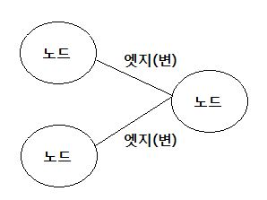
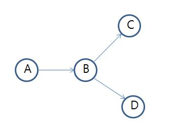
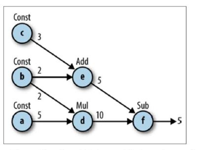
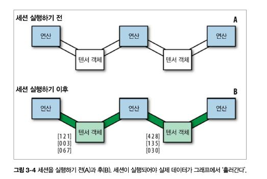
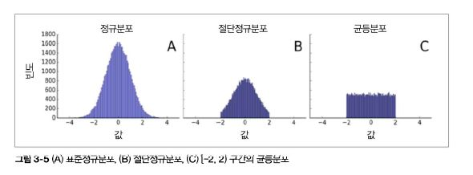

### 3장. 텐서플로 기본


#### 3.1 연산 그래프

##### 3.1.1 연산 그래프란?



- 그래프 : **노드**나 **꼭짓점**이라고 부르는 서로 연결된 **개체**의 집합

- 데이터 그래프에서 **변** : 어떤 노드에서 다른 노드로 흘러가는[^flow] 데이터의 방향 지정

- 텐서플로에서 노드 : 하나의 **연산**, 입력값을 받을 수 있고 다른 노드로 전달한 결과값을 출력할 수 있다.

  

  > 그래프를 계산한 다는 것 : 각각의 설비(노드)가 원자재(입력값)를 가져오거나 생성하여,
  >
  > ​	원자재를 가공한 후 다른 설비에 전달하는 과정을 순서대로 수행하여 부품을 만들고,
  >
  > ​		이러한 부분 생산 과정을 모아 최종 제품을 만들어 내는 것과 같다.


##### 3.1.2 연산 그래프의 장점

텐서플로는 그래프의 연결 상태를 기반으로 연산을 최적화한다. (?)  

각 그래프에는 노드 간에 의존관계가 존재한다.

**노드 y의 입력**이 **노드 x의 결과값**에 영향을 받을 때 *노드 y는 노드 x에 의존한다*고 말한다.

* 직접적으로 의존 : 두 노드가 하나의 변으로 직접 연결되어 있는 경우. *예)* B -> C

- 간접적으로 의존 : 두 노드가 하나의 변으로 직접 연결되어 있지 않은 경우. *예)* A -> C




-----------

#### 3.2 그래프, 세션, 페치

> 텐서플로의 동작은 그래프를 만들고 [^1] 실행하는[^2] 두 단계로 크게 나뉜다.  

##### 3.2.1 그래프 만들기

```python
# 1. 비어있는 기본 그래프가 만들어지며, 만드는 모든 노드는 이 기본 그래프에 자동 연결된다.
import tensorflow as tf

# 2. tf.<operator> 메소드를 사용해 임의로 명명된 변수에 할당된 6개 노드 생성
# 이 변수의 값은 연산의 출력으로 간주.

# - 세 노드는 상수값을 출력한다.
a = tf.constant(5)
b = tf.constant(2)
c = tf.constant(3)

# - 다음 세 노드는 계산 연산을 수행한다. 축약형 가능
d = tf.multiply(a, b)    # *
e = tf.add(c, b)         # +
f = tf.substract(d, e)   # -

```



​												[결과 그래프]


| 텐서플로 연산      | 축약형 연산자 | 설명                                                         |
| ------------------ | ------------- | ------------------------------------------------------------ |
| tf.add()           | a + b         | 대응되는 원소끼리 a와 b를 더한다.                            |
| tf.multiply()      | a * b         | 대응되는 원소끼리 a와 b를 곱한다.                            |
| tf.subtract()      | a - b         | 대응되는 원소끼리 a에서 b를 뺀다.                            |
| tf.divide()        | a / b         | 파이썬 3.x 방식으로 a를 b로 나눈다. (소수점까지)             |
| tf.pow()           | a ** b        | 대응되는 원소끼리 a의 b의 제곱을 계산한다.                   |
| tf.mod()           | a % b         | a를 b로 나눈 나머지                                          |
| tf.logical_and()   | a & b         | a와 b의 논리곱. dtype은 반드시 tf.bool                       |
| tf.greater()       | a > b         | 반대는 less() , 참 거짓 반환                                 |
| tf.greater_equal() | a >= b        | 반대는 less_equal() , 참 거짓 반환                           |
| tf.negative()      | -a            | a의 각 원소의 반대 부호의 값 반환                            |
| tf.logical_not()   | ~a            | a의 각 원소늬 반대의 참거짓 반환. dtype이 tf.bool인 객체에만 |
| tf.abs()           | abs(a)        | a의 각 원소의 절대값 반환                                    |
| tf.logical_or()    | a \| b        | a와 b의 논리합. dtype은 반드시 tf.bool                       |


##### 3.2.2 세션을 만들고 실행하기

연산 그래프를 만들고 나면 연산 그래프에 구성된 연산을 실행할 준비가 된 것이다.

연산을 실행하려면 세션을 만들고 실행한다. *위 코드에 추가*

```python
# 1. 그래프를 시작한다. 
sess = tf.Session()

# 2. 그래프 실행
outs = sess.run(f)    # f = tf.substract(d, e)

# 3. 세션을 닫는다.
sess.close()
print("outs = {}".format(outs))    # outs =  5
```


* Session 객체 : 텐서플로 API의 일부. 파이썬 객체와 데엍, 객체의 메모리가 할당되어 있는 실행 환경 사이를 연결하며, 중간 결과를 저장하고 최종 결과를 작업 환경으로 보내준다.
* sess.run() : 출력이 나와야 하는 노드에서 시작해 역방향으로 처리하여 의존관계 집합에 따라 실행되어야 하는 노드의 연산을 수행한다. 즉, 그래프에서 연산이 수행될 부분은 출력하고자 하는 내용에 따라 결정된다.
  * 인자로 넘겨준 노드에서 부터 해당 노드와 의존관계에 있는 노드를 역방향으로 거슬러가면서 연산.
* sess.close() : 세션을 닫는다. 세션세어 사용하는 자원을 해제한다.


##### 3.2.3 그래프의 생성과 관리

```python
# 기본 그래프가 만들어 진다.
import tensorflow as tf
print(tf.get_default_graph())  

# 새로운 그래프를 만들어서 g에 할당
g = tf.Graph()
print(p)     
```

* tf.Graph() : 텐서플로 객체로 표현되는 새로운 그래프를 만든다.
*  tf.get_default_graph() : 어떤 그래프가 현재 기본 그래프인지 반환.


````python
g = tf.Graph()
a = tf.constant(5)

print(a.graph is g)    # False
print(a.graph is tf.get_default_graph())   # True
````

연산이 g의 그래프가 아니라 기본 그래프(import)에 연결되어있다.

g를 기본 그래프로 지정하지 않았기 때문에 연산을 생성하면 새 그래프가 아니라 기본 그래프에 연결된다.


```python
g1 = tf.get_default_graph()
g2 = tf.Graph()

print(g1 is tf.get_default_graph())    # True

with g2.as_default():
    print(g1 is tf.get_default_graph())   # False
    
print(g1 is tf.get_default_graph())   # True
```

* with 구문을 as_default()와 함께 사용하면, 해당 그래프가 기본 그래프인 콘텍스트 관리자를 반환한다. 이 구문을 사용하면 명시적으로 세션을 닫지 않고 세션을 시작할 수 있다.


##### 3.2.4 페치

페치 : 연산하고자 하는 그래프의 요소, 텐서플로 메소드에 인수.

```python
with tf.Session() as sess:
    fetches = [a, b, c, d, e, f]
    outs = sess.run(fetches)
   
print("outs = {}".format(outs))
print(type(outs[0]))
```


----------------------

#### 3.3 텐서의 흐름

텐서플로에서 노드와 변이 실제로 표현되는 방법과 이들의 특성을 제어하는 방법을 설명한다.


##### 3.3.1 노드는 연산, 변은 텐서 객체

**예)** tf.add() 그래프에서 노드는 만들 때

1.  연산 인스턴스 생성
2. 계산된 결과를 다른 노드로 전달할 수 있는 핸들, 즉 **흐름(변, 텐서 객체)**으로 참조된다. (그래프 실행 전에는 실제 값을 내놓지 않는다.)




텐서플로는 모든 구성 요소가 담긴 그래프의 골격을 먼저 만들도록 설계되어있다. 이 시점에는 **실제 데이터는 흐르지 않으며 연산도 수행되지 않는다.** 세션이 실행되어 그래프에 데이터가 입력되고 계산될 때 연산이 수행된다.

텐서 객체는 각각 name, shape, dtype 같은 속성이 있어 식별 및 설정이 가능하다. 

**소스연산** : 이 전에 처리된 입력을 사용하지 않고 데이터를 생성하는 연산.


##### 3.3.2 데이터 타입 (dtype)

- 텐서 객체를 만들 때 데이터 타입을 지정하여 명시적으로 선택할 수 있다.

```python
c = tf.constant(4.0, dtype=tf.float64) #64비트 부동소수점
print(c)
print(c.type)
```

- 형변환

  - 일치하지 않는 두 데이터 타입을 가지고 연산을 실행 할 때 데이터 타입을 변견한다.

    ```python
    x = tf.constant([1,2,3], name='x', dtype=tf.float64)
    print(x.type)
    # 형변환
    # tf.cast(변환할 텐서, 새 데이터 타입)
    x = tf.cast(x, tf.int64)
    print(x.type)
    ```


##### 3.3.3 텐서 배열과 형태 (shape)

- 텐서라는 명칭의 2가지 사용

  - 그래프 연산의 결과에 대한 핸들
  - n차원 배열을 가리키는 수학 용어

  ```python
  import numpy as np
  
  # 2 X 3
  c = tf.constant([
      [1,2,3],
      [4,5,6]
  ])
  print("input1 : {}".format(c.get_shape()))
  
  # 2 X 2 X 3
  c = tf.constant(np.array([
      [[1,2,3],
      [4,5,6]] ,
      [[1,1,1],
      [2,2,2]]
  ]))
  print("input2 {}".format(c.get_shape()))
  ```

  - get_shape() : 텐서의 형태를 정수의 튜플로 반환. 튜플 원소 = 텐서의 차원 수 / 각 정수 = 차원의 배열 항목 개수

- **난수 생성기** : 텐서플로 변수의 초깃값을 지정하는 데 널리 사용. 

  

  ​	절단정규분포 : 평균으로부터 표준편차를 기준으로 크거나 작은 값들을 제거한 것.

  ​	균등분포 : 정해진 구간 [a,b] 사이에서 균등하게 값을 추출


- **행렬곱** 

```python

# 행렬 A와 벡터 x를 생성
A = tf.constant([
    [1,2,3],
    [4,5,6]
])
print(A.get_shape())    # (2, 3)

x = tf.constant([1,0,1])
print(x.get_shape())    # (3, )

# 행렬 A와 벡터 x를 곱하려면 x에 차원을 추가해서 
# 1차원벡터 -> 하나의 열을 가진 2차원 행렬로 만들어 줘야 한다.
x = tf.expand_dims(x, 1)   # x에 두번째 위치(인덱스 1)에 차원 추가
print(x.get_shape()) (3, 1)

b = tf.matmul(A, x)
```


##### 3.3.4 이름 (name)

- 각 텐서 객체마다 고유의 이름을 가진다.
- 

